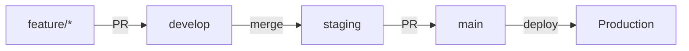

# CI/CD Overview

## 🎯 Introduction

This project implements a **professional CI/CD pipeline** optimized for small teams (2-10 developers) using **GitHub Actions** and **Render** for deployment.

## 🌲 Branch Strategy

We follow a **progressive validation strategy** with three main branches:



### Branch Purposes

| Branch | Purpose | Protection | Tests |
|--------|---------|-----------|-------|
| **feature/** | New features & fixes | None | Local dev |
| **develop** | Active development | 1 approval | Fast validation |
| **staging** | Integration testing | 1 approval | Full tests |
| **main** | Production-ready | 2 approvals | Deployment |

---

## 🔄 Complete Workflow

### 1. Feature Development
```bash
git checkout -b feature/my-feature
# ... make changes ...
git push origin feature/my-feature
```

### 2. Pull Request to Develop
- **Triggers:** CI Pipeline
- **Duration:** ~8-10 minutes
- **Checks:**
  - TypeScript validation
  - ESLint
  - Unit tests
  - Build verification
  - npm audit
  - Gitleaks (secret detection)

### 3. Merge to Staging
```bash
git checkout staging
git merge develop
git push origin staging
```

- **Triggers:** Staging Validation Pipeline
- **Duration:** ~15-20 minutes
- **Checks:**
  - Integration tests
  - E2E tests (containerized)
  - CodeQL SAST
  - Trivy container scan
  - Docker build validation

### 4. Pull Request to Main
- **Triggers:** Main PR Pipeline
- **Duration:** ~5 minutes
- **Checks:**
  - Quick sanity tests
  - Deployment readiness

### 5. Production Deployment
- **Triggers:** Automatic on merge to main
- **Duration:** ~12-15 minutes
- **Process:**
  - Semantic versioning (YYYY.MM.DD-SHA)
  - Docker build & push
  - Render deployment
  - Smoke tests

---

## ⏱️ Pipeline Timings

| Stage | Pipeline | Duration | When |
|-------|----------|----------|------|
| **Develop PR** | CI Pipeline | 8-10 min | Every feature PR |
| **Staging Push** | Staging Tests | 15-20 min | After merge to staging |
| **Main PR** | Main Check | 5 min | PR to production |
| **Deployment** | CD Pipeline | 12-15 min | Merge to main |
| **Total** | End-to-end | **40-50 min** | Feature → Production |

---

## 🔒 Security Scanning

### Multi-Layer Security

Our pipeline includes comprehensive security scanning:

#### 1. Dependency Vulnerabilities
- **npm audit** - Every PR
- Checks for known CVEs
- Fails on HIGH/CRITICAL severity

#### 2. Secret Detection
- **Gitleaks** - Every PR
- Detects hardcoded credentials
- Scans commit history
- Prevents secret leaks

#### 3. Static Application Security Testing (SAST)
- **CodeQL** - Staging only
- Deep code analysis
- Detects:
  - SQL injection
  - XSS vulnerabilities
  - Command injection
  - Insecure cryptography

#### 4. Container Security
- **Trivy** - Staging only
- Scans Docker images
- OS package vulnerabilities
- Library CVEs
- **Fails on CRITICAL vulnerabilities**

---

## 📊 Security Coverage

```
┌─────────────────────────────────────┐
│         Security Layers             │
├─────────────────────────────────────┤
│                                     │
│  🔒 Gitleaks → Secrets              │
│  📦 npm audit → Dependencies        │
│  🔍 CodeQL → Code Vulnerabilities   │
│  🐳 Trivy → Container CVEs          │
│  👥 Code Review → Logic & Design    │
│                                     │
└─────────────────────────────────────┘
```

---

## 🎯 Philosophy

### Fast Feedback
- **Develop PRs:** Quick checks (8-10 min)
- Developers get immediate feedback
- Encourages frequent commits

### Thorough Validation
- **Staging:** Comprehensive testing (15-20 min)
- Catches integration issues
- Validates production-readiness

### Confident Deployment
- **Main:** Already thoroughly tested
- Quick final check (5 min)
- Production deploys with confidence

---

## 📈 Metrics & Goals

### Speed Goals
- ✅ Feature → Develop PR: < 10 minutes
- ✅ Staging validation: < 20 minutes
- ✅ Production deployment: < 15 minutes

### Quality Goals
- ✅ CI pass rate: > 90%
- ✅ Zero production hotfixes per week
- ✅ Security vulnerabilities: Caught before merge

### Team Goals
- ✅ Daily merges to develop
- ✅ Weekly deployments to production
- ✅ < 24 hour PR cycle time

---

## 🚀 Getting Started

1. **Read:** [Branch Strategy](./branch-strategy)
2. **Setup:** [Branch Protection](./branch-protection)
3. **Learn:** [Developer Workflow](./developer-workflow)
4. **Understand:** [Pipeline Details](./pipeline-details)

---

## 📚 Quick Links

- [Branch Strategy & Protection](./branch-strategy)
- [Developer Workflow Guide](./developer-workflow)
- [Pipeline Details & Configuration](./pipeline-details)
- [Deployment & Rollback](./deployment)
- [Troubleshooting](./troubleshooting)

---

## 💡 Why This Approach?

### For Small Teams (2-10 developers)

**✅ Advantages:**
- Simple to understand
- Fast feedback loops
- Comprehensive security
- Production-ready practices
- Scales to ~15 developers

**❌ What We Avoid:**
- Over-engineering
- Slow pipelines (18+ min)
- Complex orchestration
- Excessive approvals
- Process overhead

### When to Evolve

**Indicators you need more:**
- Team grows beyond 10-15 people
- Multiple teams working on same codebase
- Compliance requirements (SOC2, HIPAA)
- > 20 PRs per week
- Need dedicated QA environment

---

## 🎓 Next Steps

Continue to the next sections to learn:
- How to set up branch protection
- Daily developer workflow
- Pipeline configuration details
- Deployment and rollback procedures
