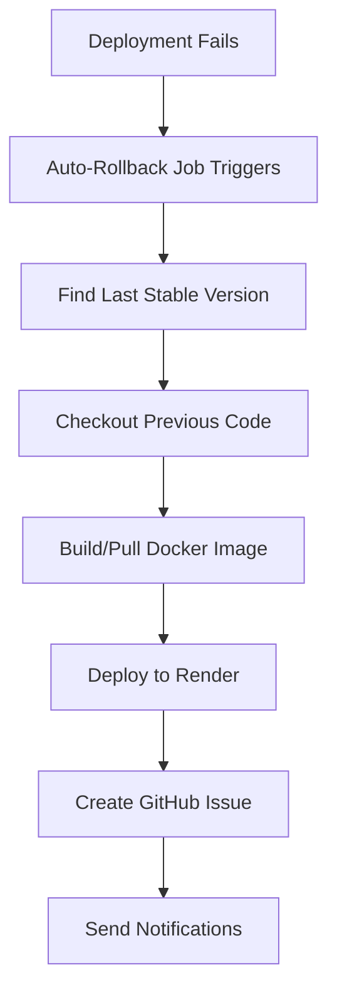
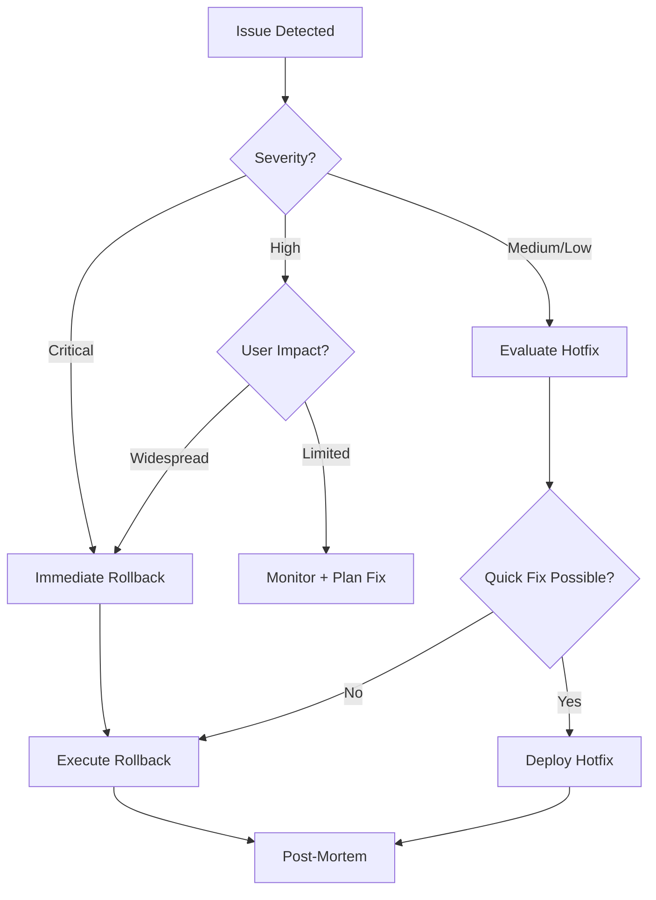

# 🔄 Rollback Playbook

## Overview

This playbook covers all rollback scenarios and procedures for the WorkTime Leave Manager application.

---

## 🚨 Automatic Rollback

### When It Triggers

The automatic rollback system activates when:

1. **Deployment fails** during the CD pipeline
2. **Smoke tests fail** after deployment
3. **Health checks fail** after deployment timeout

### What Happens Automatically



### Automatic Rollback Process

1. **Detection** (~1 minute)
   - System detects deployment or smoke test failure
   - Auto-rollback job starts immediately

2. **Version Selection** (~30 seconds)
   - Scans recent version tags
   - Finds last successful deployment
   - Excludes current failed version

3. **Image Preparation** (~2-5 minutes)
   - Checks if Docker image exists
   - Pulls existing image OR rebuilds from source
   - Pushes to container registry

4. **Deployment** (~5-10 minutes)
   - Triggers Render deployment
   - Uses previous stable version
   - Monitors deployment status

5. **Notification** (~1 minute)
   - Creates GitHub issue with details
   - Labels: `deployment-failure`, `auto-rollback`, `urgent`
   - Includes failure analysis

**Total Time:** 10-17 minutes

---

## 🔧 Manual Rollback

### When to Use Manual Rollback

- Automatic rollback failed
- Need to rollback to specific version (not just previous)
- Detected issue after successful deployment
- Emergency production fix needed

### Method 1: GitHub Actions UI (Recommended)

#### Step-by-Step Process

1. **Go to Actions Tab**
   ```
   https://github.com/your-repo/actions/workflows/cd.yml
   ```

2. **Click "Run workflow"**
   - Select branch: `main`
   - Choose action: `rollback`

3. **Enter Parameters**
   ```yaml
   Version: 2024.03.05-abc1234    # Target version tag
   Reason: "Critical bug in payment module"
   ```

4. **Start Rollback**
   - Click "Run workflow"
   - Watch progress in real-time

5. **Verify**
   - Check Render dashboard
   - Run smoke tests
   - Monitor application logs

#### Time Estimate
- **5-15 minutes** depending on image availability

---

### Method 2: List Available Versions First

If you don't know which version to rollback to:

1. **List Versions**
   ```
   Actions → CD Pipeline → Run workflow
   Action: list-versions
   ```

2. **Review Output**
   ```
   📋 AVAILABLE VERSIONS FOR ROLLBACK
   
   📦 2024.03.05-abc1234
      Commit: abc1234567890abcdef
      Date: 2024-03-05 14:30:00
      Message: feat: Add leave approval workflow
   
   📦 2024.03.04-def5678
      Commit: def567890abcdef12345
      Date: 2024-03-04 10:15:00
      Message: fix: Resolve date calculation bug
   ```

3. **Select Version**
   - Choose stable version
   - Run rollback with selected version

---

### Method 3: Command Line (Advanced)

For DevOps team with GitHub CLI:

```bash
# List recent versions
gh workflow run cd.yml \
  --ref main \
  -f action=list-versions

# Perform rollback
gh workflow run cd.yml \
  --ref main \
  -f action=rollback \
  -f version="2024.03.05-abc1234" \
  -f reason="Emergency rollback due to critical bug"

# Monitor progress
gh run watch
```

---

## 🎯 Rollback Decision Matrix

### When to Rollback

| Scenario | Auto Rollback | Manual Rollback | Priority |
|----------|---------------|-----------------|----------|
| Deployment fails | ✅ Automatic | N/A | 🔴 P0 |
| Smoke tests fail | ✅ Automatic | Backup | 🔴 P0 |
| Critical bug detected | ❌ | ✅ Manual | 🔴 P0 |
| Performance degradation | ❌ | ✅ Manual | 🟡 P1 |
| Minor UI issue | ❌ | Consider hotfix | 🟢 P2 |
| Feature not working | ❌ | Evaluate impact | 🟢 P2 |

### Decision Tree



---

## 📋 Pre-Rollback Checklist

Before initiating manual rollback:

```markdown
- [ ] Confirm issue severity (P0/P1/P2)
- [ ] Check automatic rollback didn't already run
- [ ] Identify last known stable version
- [ ] Verify version availability
- [ ] Notify team in Slack/Teams
- [ ] Document reason for rollback
- [ ] Check database migration compatibility
- [ ] Prepare rollback announcement
```

---

## 🔍 Post-Rollback Actions

### Immediate (Within 15 minutes)

1. **Verify Application**
   ```bash
   # Check health endpoint
   curl https://your-app.onrender.com/health
   
   # Run quick smoke tests
   npm run test:smoke
   ```

2. **Monitor Metrics**
   - Error rates in logs
   - Response times
   - User traffic patterns
   - Database connections

3. **User Communication**
   - Status page update
   - Email notifications (if needed)
   - Support team briefing

### Short Term (Within 1 hour)

4. **Root Cause Analysis**
   - Review failed deployment logs
   - Analyze error messages
   - Check code changes in failed commit
   - Review recent PRs

5. **Issue Documentation**
   - Update GitHub issue (auto-created)
   - Add RCA findings
   - Document timeline
   - List affected users (if any)

### Long Term (Within 24 hours)

6. **Fix Planning**
   - Create fix PR
   - Add regression tests
   - Schedule deployment
   - Plan prevention measures

7. **Post-Mortem**
   - Team meeting
   - Document lessons learned
   - Update runbooks
   - Improve CI/CD if needed

---

## 🚨 Emergency Scenarios

### Scenario 1: Automatic Rollback Failed

**Symptoms:**
- Auto-rollback job shows failure
- Application still in broken state
- No GitHub issue created

**Actions:**

1. **Check Workflow Logs**
   ```
   GitHub → Actions → Failed CD run → auto-rollback job
   ```

2. **Common Failure Reasons:**
   - No previous version found
   - Docker image unavailable
   - Render API key missing
   - Network issues

3. **Manual Intervention:**
   ```bash
   # If no previous version exists
   git tag 2024.03.05-emergency $(git rev-parse HEAD~1)
   git push origin 2024.03.05-emergency
   
   # Then trigger manual rollback
   ```

4. **Direct Render Rollback:**
   - Go to Render dashboard
   - Select service
   - Click "Rollback" button
   - Select previous deployment

---

### Scenario 2: Database Migration Issues

**Problem:** New deployment has incompatible schema changes

**Solution:**

1. **Don't Rollback Code Immediately**
   - Database might be in inconsistent state
   - Rolling back code could break database

2. **Assess Migration Impact**
   ```sql
   -- Check current schema version
   SELECT * FROM _prisma_migrations ORDER BY finished_at DESC LIMIT 5;
   ```

3. **Options:**

   **Option A: Forward Fix (Preferred)**
   ```bash
   # Deploy hotfix with migration rollback
   npm run prisma:migrate:rollback
   git commit -m "fix: Rollback incompatible migration"
   # Push and deploy
   ```

   **Option B: Manual Database Rollback**
   ```bash
   # Backup database first!
   npm run prisma:migrate:resolve --rolled-back [migration-name]
   # Then rollback application
   ```

---

### Scenario 3: Partial Deployment Failure

**Problem:** Some instances updated, others didn't

**Detection:**
- Inconsistent responses
- Some users report issues, others don't
- Mixed version logs

**Actions:**

1. **Force Complete Rollback**
   - Trigger manual rollback
   - Ensure all instances update

2. **Verify Consistency**
   ```bash
   # Check version across all instances
   for i in {1..10}; do
     curl -s https://your-app.onrender.com/health | jq .version
     sleep 1
   done
   ```

3. **If Still Inconsistent:**
   - Contact Render support
   - Consider service restart
   - Monitor until stable

---

## 📊 Rollback Metrics to Track

### Key Performance Indicators (KPIs)

```yaml
Rollback Frequency:
  Target: < 5% of deployments
  Warning: > 10% of deployments
  Critical: > 20% of deployments

Rollback Time (Automatic):
  Target: < 15 minutes
  Warning: > 20 minutes
  Critical: > 30 minutes

Rollback Time (Manual):
  Target: < 10 minutes
  Warning: > 15 minutes
  Critical: > 30 minutes

Detection Time:
  Target: < 2 minutes (automatic)
  Warning: > 5 minutes
  Critical: > 10 minutes
```

### Monthly Report Template

```markdown
## Rollback Report - [Month Year]

**Summary:**
- Total Deployments: X
- Total Rollbacks: Y (Z%)
- Automatic: A
- Manual: B

**Rollback Reasons:**
1. Build failures: X%
2. Smoke test failures: Y%
3. Production bugs: Z%
4. Performance issues: W%

**Average Times:**
- Auto rollback: X minutes
- Manual rollback: Y minutes
- Detection to resolution: Z minutes

**Action Items:**
- [ ] Item 1
- [ ] Item 2
```

---

## 🛠️ Tools and Resources

### Useful Commands

```bash
# List recent tags
git tag --sort=-creatordate | head -10

# View commit of specific tag
git show <tag-name>

# Find commits between versions
git log <old-version>..<new-version> --oneline

# Check current deployed version
curl https://your-app.onrender.com/health | jq .version
```

### Dashboard Links

- **GitHub Actions:** `https://github.com/your-repo/actions`
- **Render Dashboard:** `https://dashboard.render.com/`
- **Application Health:** `https://your-app.onrender.com/health`
- **Logs:** Render Dashboard → Service → Logs

### Contact Information

```yaml
On-Call Engineer: [Contact Info]
DevOps Lead: [Contact Info]
Render Support: support@render.com
Emergency Escalation: [Process]
```

---

## 📚 Related Documentation

- [CI/CD Overview](./overview.md)
- [Branch Strategy](./branch-strategy.md)
- [Developer Workflow](./developer-workflow.md)
- [Troubleshooting Guide](./troubleshooting.md)

---

## ✅ Rollback Success Criteria

### Deployment Considered Successful When:

- [ ] Application health check returns 200 OK
- [ ] All critical endpoints respond correctly
- [ ] Error rate < 0.1%
- [ ] Response time < baseline + 10%
- [ ] Database connections stable
- [ ] No critical errors in logs (5 min window)
- [ ] User traffic returns to normal
- [ ] Monitoring alerts cleared

### Post-Rollback Sign-Off

**Required Approvals:**
- [ ] On-call engineer verified
- [ ] QA spot-check completed
- [ ] Product owner notified
- [ ] Incident documented

---

## 🎓 Training Resources

### For New Team Members

1. **Rollback Simulation Exercise**
   - Trigger manual rollback in staging
   - Practice using GitHub Actions UI
   - Review automatic rollback logs

2. **Required Reading**
   - This playbook
   - Past post-mortems
   - Incident response guide

3. **Hands-On Practice**
   - Shadow on-call engineer
   - Participate in incident reviews
   - Run tabletop exercises

---

**Last Updated:** 2024-03-05  
**Version:** 1.0  
**Owner:** DevOps Team
